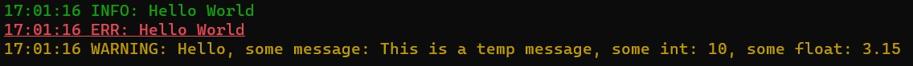

# Thin Lightweight Logging Library

### Uses C++17
<br>

## <u>Sample Usage</u>
<br>

```
#include <Logger.h>

int main()
{
    Logger::init();
    Logger::log("Hello World");
    Logger::log("Hello World", Log::ERR);

    int val = 10;
    const char* msg = "This is a temp message";
    float fVal = 3.1459f;

    Logger::logfmt<Log::WARNING>("Hello, some message: %s, some int: %i, some float: %.2f\n", msg, val, fVal);
}
```

## Output


## Usage
Just include the single header Logger.h, that's it!!
